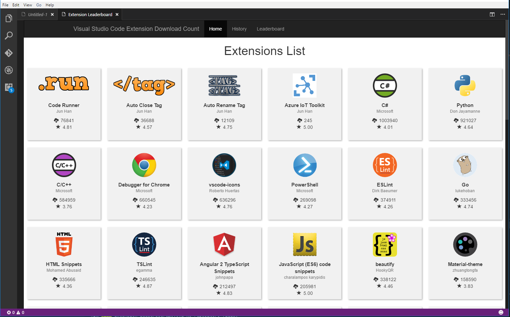
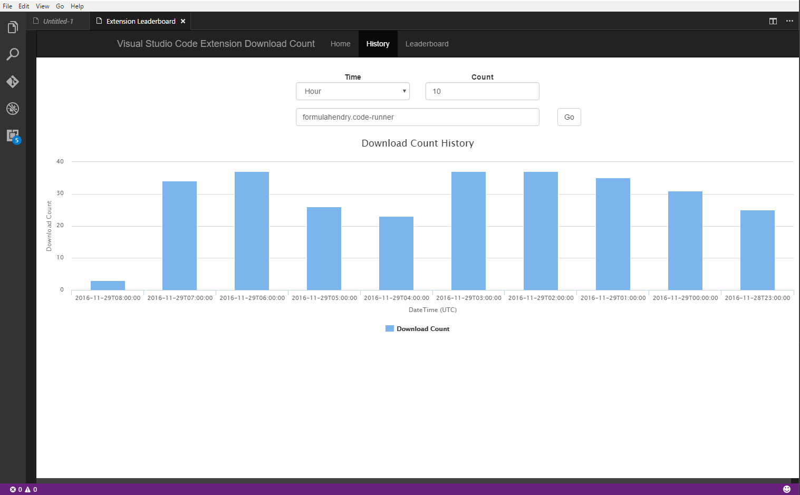
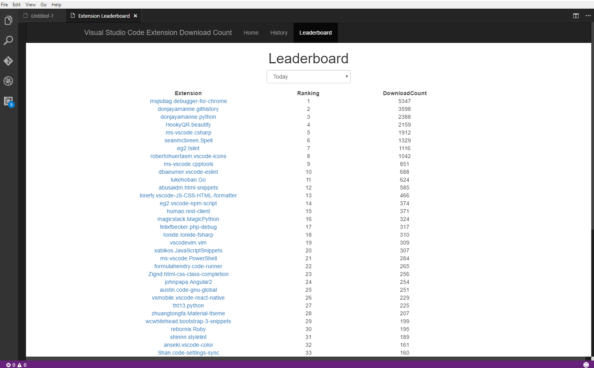

# Extension Leaderboard

Data insight for popular extensions, history of download count and extension leaderboard

## Usage

To show use shortcut `Ctrl+Alt+L`, or press `F1` and then select/type `Show Extension Leaderboard`

## Features

* Popular extension list

  

* History of download count

  

* Extension leaderboard

  

## Telemetry data
By default, anonymous telemetry data collection is turned on to understand user behavior to improve this extension. To disable it, update the settings.json as below:
```json
{
    "extension-leaderboard.enableAppInsights": false
}
```

## Change Log
See Change Log [here](CHANGELOG.md)

## Issues
Submit the [issues](https://github.com/formulahendry/vscode-extension-leaderboard/issues) if you find any bug or have any suggestion.

## Contribution
Fork the [repo](https://github.com/formulahendry/vscode-extension-leaderboard) and submit pull requests.